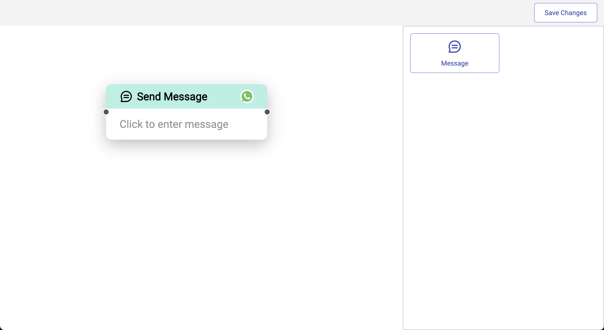
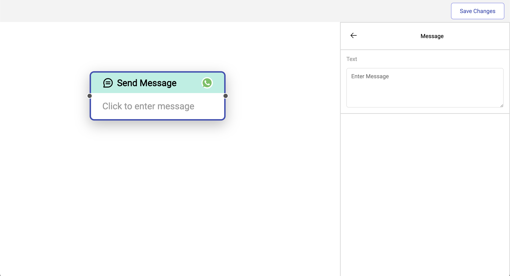
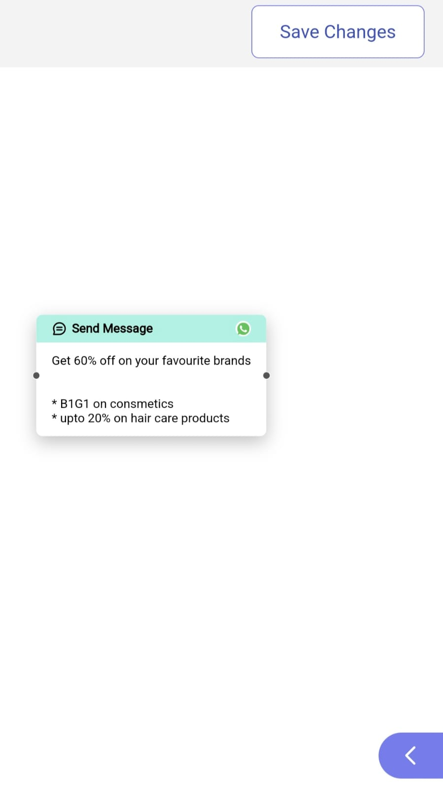
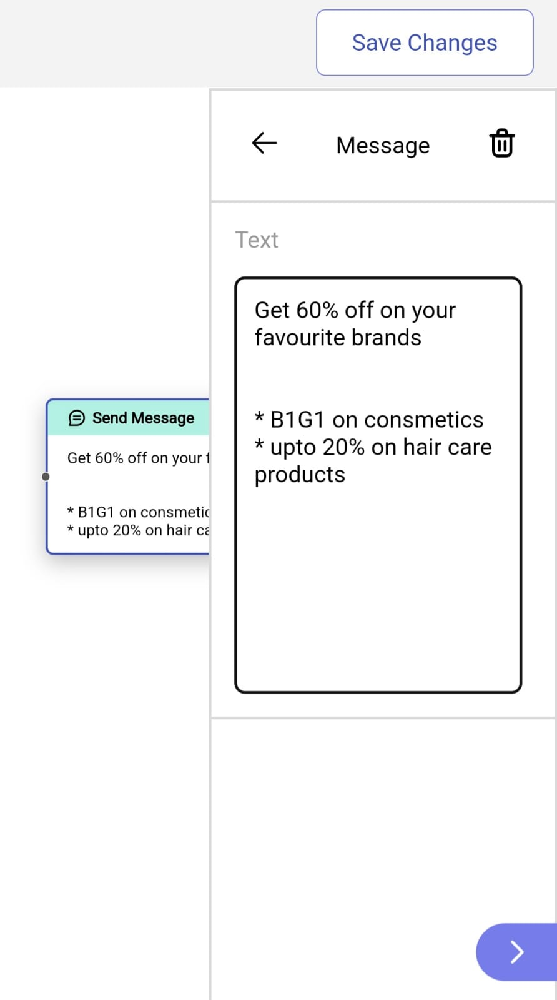
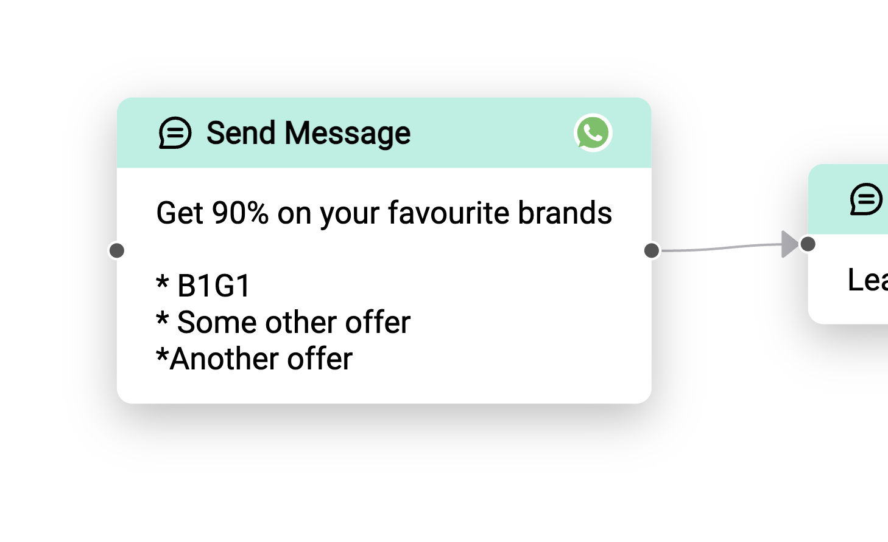
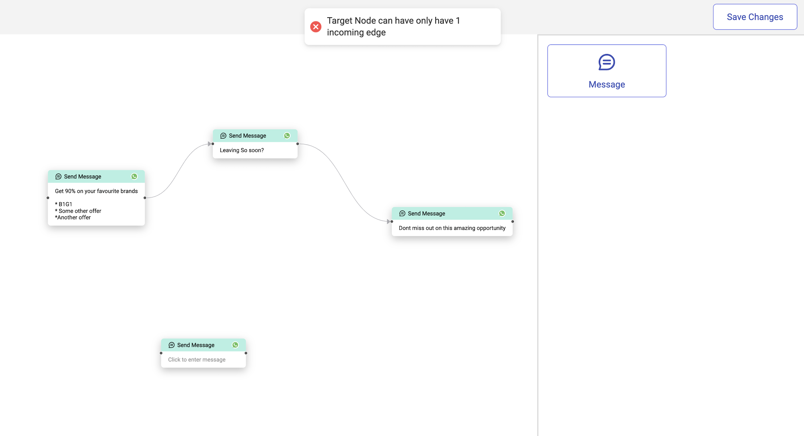
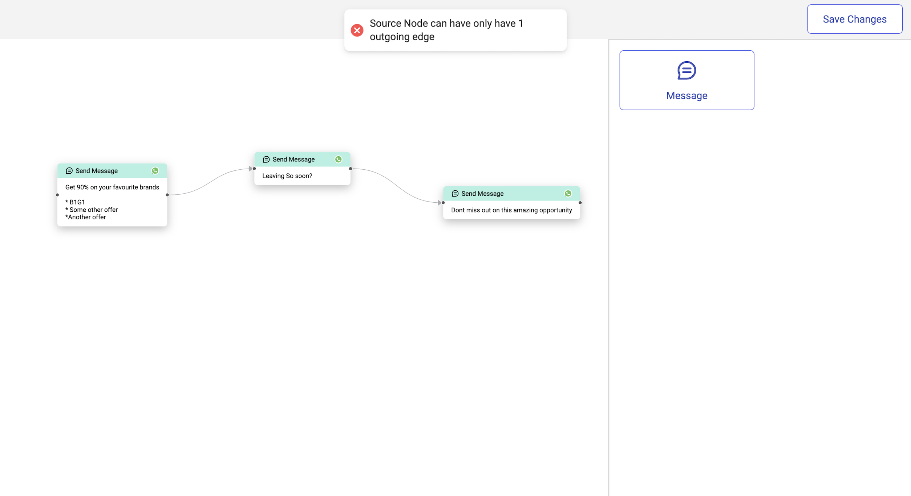
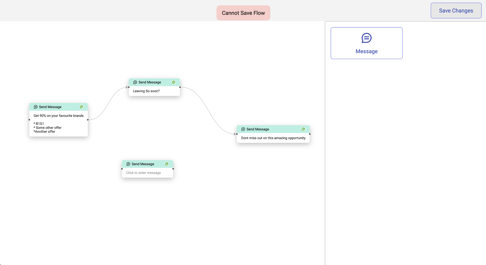
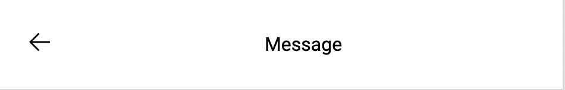
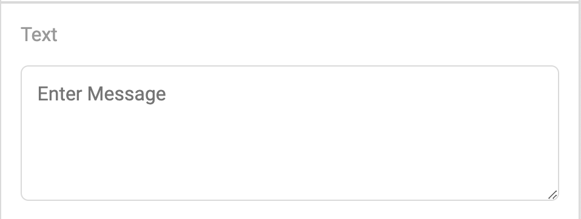

<a name="readme-top"></a>

<!-- PROJECT LOGO -->
<br />
<div align="center">
  <h3 align="center">Bitespeed Chat Builder Application</h3>

  <p align="center">
 Our Chat Builder app is a user-friendly tool designed to streamline the process of creating conversational interfaces or chatbots.
    <br />
    <br />
    <a href="https://boisterous-semifreddo-52bf6e.netlify.app/">View Demo</a>
    ·
    <a href="https://github.com/chickoocoutinho/react-flow-example/issues/new?labels=bug&template=bug-report---.md">Report Bug</a>
    ·
    <a href="https://github.com/chickoocoutinho/react-flow-example/issues/new?labels=enhancement&template=feature-request---.md">Request Feature</a>
  </p>
</div>

<!-- TABLE OF CONTENTS -->
<details>
  <summary>Table of Contents</summary>
  <ol>
    <li>
      <a href="#about-the-project">About The Project</a>
      <ul>
        <li><a href="#built-with">Built With</a></li>
         <li><a href="#prerequisites">Prerequisites</a></li>
        <li><a href="#installation">Installation</a></li>
      </ul>
    </li>
    <li>
      <a href="#screenshots">Screenshots</a>
      <ul>
        <li><a href="#homepage">Home Page</a></li>
        <li><a href="#message-node">Message Node</a></li>
        <li><a href="#validations">Validations</a></li>
      </ul>
    </li>
    <li><a href="#documentation">Documentation</a>
    <ul>
        <li><a href="#flowcontext">FlowContext</a></li>
        <li><a href="#nodes">Nodes</a></li>
        <li><a href="#helper-functions">Helper Functions</a></li>
      </ul>
      </li>

###

  </ol>
</details>

<!-- ABOUT THE PROJECT -->

## About The Project



### Built With

-   React.js
-   reactflow
-   clsx
-   CSS modules

### Prerequisites

This is an example of how to list things you need to use the software and how to install them.

-   node
    ```
    v>=18.0.0
    ```
-   npm
    ```sh
    npm install npm@latest -g
    ```

### Installation

1. Clone the repo
    ```sh
    git clone https://github.com/chickoocoutinho/react-flow-example
    ```
2. Install NPM packages
    ```sh
    npm install
    ```
3. To run the project
    ```sh
     npm run dev
    ```

<p align="right">(<a href="#readme-top">back to top</a>)</p>

<!-- USAGE EXAMPLES -->

## Screenshots

### Homepage

#### Desktop Viev



#### Mobile Viev

|  |  |
| -------------------------------------------------- | ---------------------------------------------------------- |

### Message Node



### Validations

#### Incoming Edge Validation



#### Outgoing Edge Validation



#### Save Edge Validation



## Documentation

### FlowContext

All logic to edit/add/delete nodes and edges of the React Flow component are present in this context. This allows us to create multiple different UI elements with the react Flow component by wrapping it with the FlowContextProvider and using the funtions from the FlowContext.

**Note:** Save Functionality is not kept in FlowContext to provide more flexibility for on save validations.

### Nodes

-   All custom nodes need to extend the BaseNode component.
-   Base node component containst default styling.
-   Each node needs to export 3 things:
    -   Custom Node component,
    -   Node type string ( To be passed to react flow )
    -   A node Icon ( SVG to be displayed in the nodes panel )
-   Each Custom node must have a corresponding settings component. This component will be rendered in the settings panel when the node is selected.
-   **Note:** After creating a custom node, update the helper functions in Nodes/helper.jsx.

### Helper Functions

These helper functions allow us to add more nodes without the need to make any code changes in the chat builder.

#### getNodeDefaultData

Helper function to get the Default Data object for each node type. Used while adding a new node.

#### getAllNodeTypes

Helper function to get an array of all node type to be displayed in the nodes panel

#### getNodeSettingsHeading

Helper Function to get the heading text of the settings panel based on node type.


#### getNodeSettingsComponent

Helper function to render content of settings panel based on node type


#### getMaxIncomingOutgoingEdgeCount

Helper function to get the maximum count incoming and outgoing edges based on node type. This function is used to validate whether on not the connection is valid.
